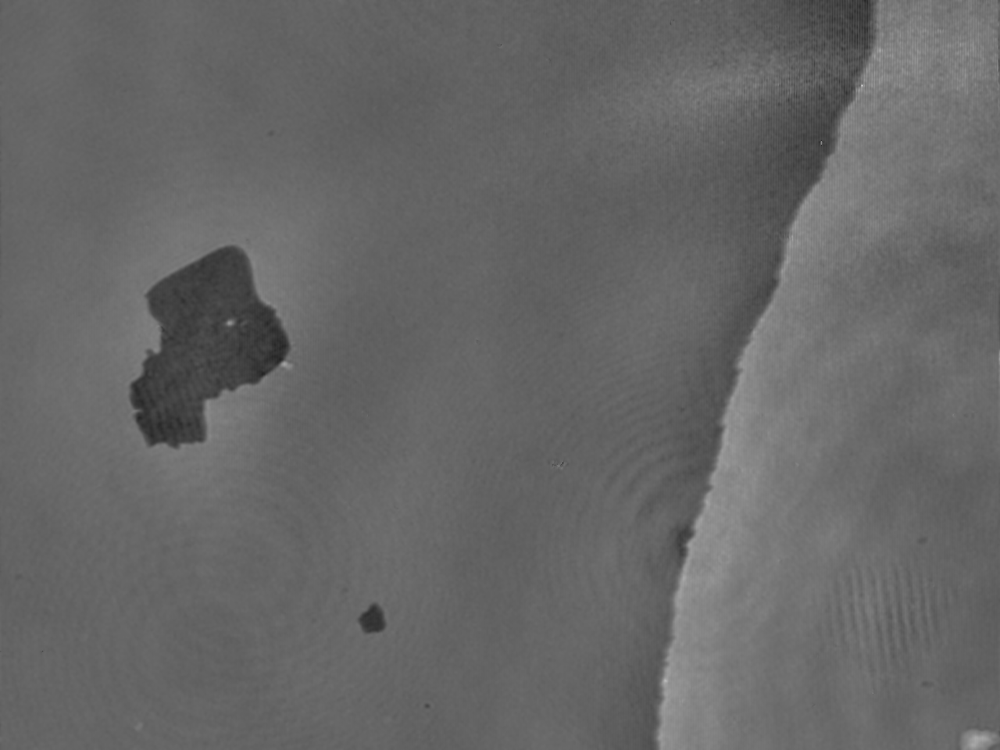

# A simple script for Quantitative Phase Imaging

This contains a simple script to extract the local phase values from the image with interference pattern.

## Example

**original / extracted phase image**



## Requirements

This script requires

+ numpy
+ scipy

## Usage

```
python extract_phase.py [path/to/image]
```

This saves the extracted value as an image file with suffix `_amp` (for amplitude) and `_phase` (for phase).

### Phase difference from an reference image

```
python extract_phase.py [path/to/reference_image] [path/to/target_image1] [path/to/target_image2] ...
```

## Detailed tuning

See `settings.ini`.

### Typical tuning

- `n_waves` number of waves to be averaged. Larger this value, lower the low-path cut-off frequency.
- `format` output type. If `bmp`results will be saved as a `bmp` file with squeezing the result into 8-bit. If `csv`, the result will be a `csv` file.
